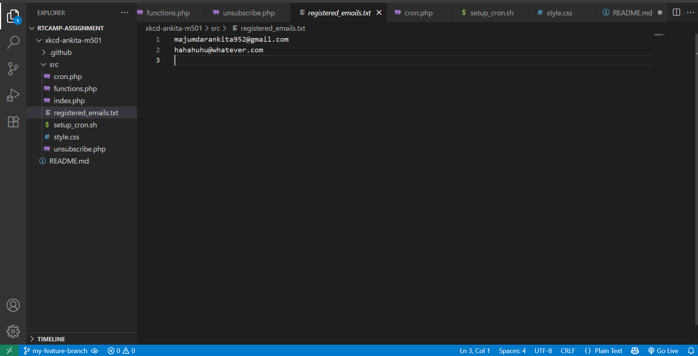

# XKCD Mailer 📬

This project implements an email subscription system that delivers [XKCD](https://xkcd.com/) comics to users daily. Users can subscribe with their email addresses, receive comics via email, and unsubscribe securely using a verification code.

## 🔧 Features

- ✅ Email subscription system for XKCD comics
- ✅ Daily automated delivery of XKCD comics via Cron job
- ✅ Unsubscribe functionality secured by verification code
- ✅ Validation and verification for email addresses
- ✅ Clean and responsive UI

---

## 🖼️ Demo

📽️ [Watch the demo video](https://drive.google.com/file/d/1HjlqThzp6KRdG5qp64RKrf82yrKiUVRF/view?usp=sharing)
🔍 Screenshots:
- **Subscription Page**
- **Email Inbox Preview**  
- **Unsubscribe Flow**
    
    
    
    
    
    
    
    
    
    
 

## 🧰 Tech Stack

- **Frontend:** HTML, CSS, JavaScript 
- **Backend:** PHP
- **Database:** registered_emails is used as the database
- **Email:** PHPMailer
- **Scheduler:** Cron (Linux) or Task Scheduler (Windows)

